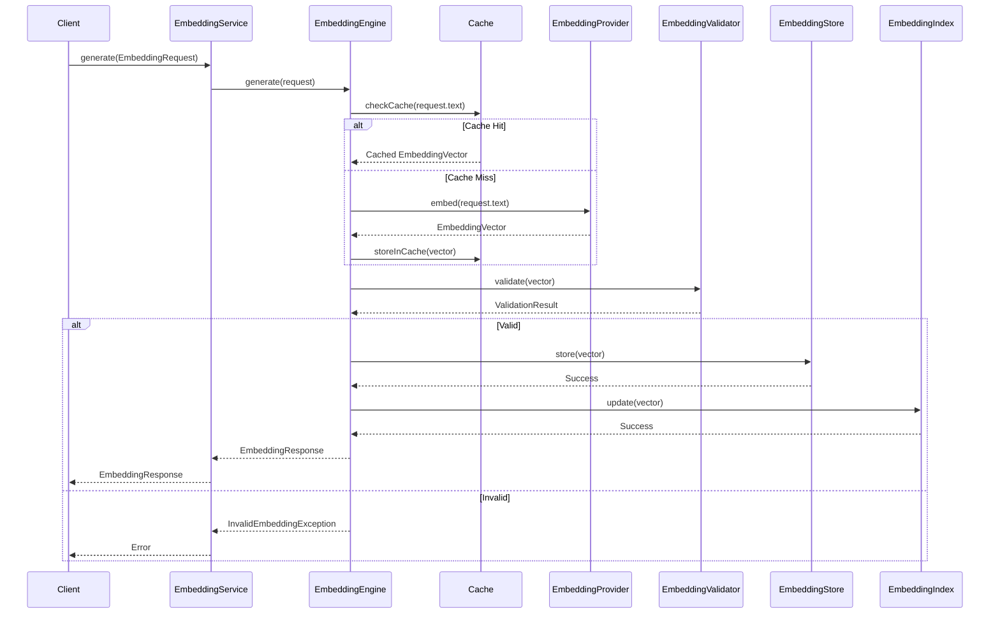
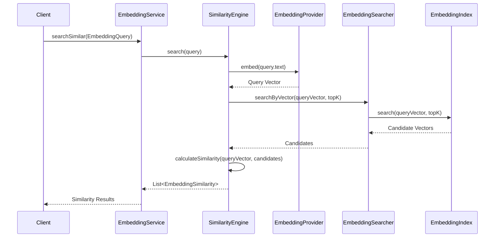

# Embedding Subsystem Design

**Target Kernel:** platform/kernels/memory
**Document Type:** Engineering Design Specification
**Status:** DESIGN
**Date:** 2026-07-22

---

## 1. Purpose

### Why Embeddings Are Required

Embeddings are required to enable semantic understanding and similarity-based retrieval in the Shree AI OS platform. They transform discrete data (text, concepts, entities) into continuous vector representations that capture semantic meaning, enabling:

- **Semantic Search:** Find conceptually similar items even without exact keyword matches
- **Similarity Detection:** Identify related concepts, memories, or knowledge
- **Clustering:** Group similar items automatically
- **Retrieval-Augmented Generation (RAG):** Enhance AI responses with relevant context
- **Memory Association:** Connect related memories and experiences
- **Knowledge Graph Enhancement:** Enrich graph relationships with semantic similarity

### Kernel Ownership

**Owner:** platform/kernels/memory

**Rationale:** Embeddings are a memory enhancement capability. They enable semantic memory retrieval and are tightly coupled with:
- Memory storage and retrieval
- Semantic memory
- Knowledge graph integration
- Context-aware memory access

### Responsibilities

**In Scope:**
- Generate embeddings from text, concepts, and entities
- Store embedding vectors with metadata
- Retrieve embeddings by ID or query
- Perform similarity search (cosine, euclidean, dot product)
- Manage embedding indices for efficient retrieval
- Validate embedding dimensions and quality
- Support multiple embedding providers
- Cache frequently accessed embeddings
- Track embedding versions and models

**Out of Scope:**
- LLM integration (delegated to cognitive kernel)
- Text preprocessing (delegated to cognitive kernel)
- Knowledge graph management (delegated to knowledge kernel)
- Context management (delegated to context kernel)
- Vector database implementation (uses external providers)

---

## 2. Package Structure

### Proposed Hierarchy

```
platform/kernels/memory/
├── api/
│   ├── EmbeddingService.java
│   ├── EmbeddingProvider.java
│   ├── EmbeddingGenerator.java
│   ├── EmbeddingStore.java
│   ├── EmbeddingSearcher.java
│   ├── EmbeddingValidator.java
│   └── package-info.java
├── service/
│   ├── DefaultEmbeddingService.java
│   ├── CachedEmbeddingService.java
│   └── package-info.java
├── engine/
│   ├── EmbeddingEngine.java
│   ├── DefaultEmbeddingEngine.java
│   ├── SimilarityEngine.java
│   └── package-info.java
├── model/
│   ├── EmbeddingVector.java
│   ├── EmbeddingMetadata.java
│   ├── EmbeddingRequest.java
│   ├── EmbeddingResponse.java
│   ├── EmbeddingSimilarity.java
│   ├── EmbeddingIndex.java
│   ├── EmbeddingModel.java
│   ├── EmbeddingProviderType.java
│   └── package-info.java
├── validation/
│   ├── EmbeddingValidator.java
│   ├── VectorValidator.java
│   ├── DimensionValidator.java
│   ├── ProviderValidator.java
│   └── package-info.java
├── verification/
│   ├── EmbeddingArchitectureVerifier.java
│   ├── EmbeddingContractVerifier.java
│   ├── EmbeddingIntegrityVerifier.java
│   └── package-info.java
└── error/
    ├── EmbeddingException.java
    ├── InvalidEmbeddingException.java
    ├── ProviderUnavailableException.java
    ├── VectorDimensionException.java
    ├── IndexException.java
    └── package-info.java
```

### Structure Rationale

This structure follows the standard kernel architecture pattern:
- **api/**: Interface definitions (contracts)
- **service/**: Service implementations (orchestration)
- **engine/**: Processing engines (generation, similarity)
- **model/**: Data models (vectors, metadata, requests)
- **validation/**: Input/output validation
- **verification/**: Architecture verification
- **error/**: Exception hierarchy

---

## 3. Public Interfaces

### 3.1 EmbeddingService

**Responsibility:** Main entry point for embedding operations

**Methods:**
- `EmbeddingResponse generate(EmbeddingRequest request)` - Generate embedding from input
- `List<EmbeddingResponse> generateBatch(List<EmbeddingRequest> requests)` - Batch generation
- `EmbeddingResponse retrieve(String embeddingId)` - Retrieve embedding by ID
- `List<EmbeddingSimilarity> searchSimilar(EmbeddingQuery query)` - Similarity search
- `void store(EmbeddingVector vector)` - Store embedding
- `void delete(String embeddingId)` - Delete embedding

**Clients:** All kernels requiring embedding capabilities

### 3.2 EmbeddingProvider

**Responsibility:** Abstraction for embedding generation providers

**Methods:**
- `EmbeddingVector embed(String text)` - Generate embedding from text
- `EmbeddingVector embed(Concept concept)` - Generate embedding from concept
- `int getDimension()` - Get vector dimension
- `EmbeddingModel getModel()` - Get model information
- `boolean isAvailable()` - Check provider availability

**Implementations:** OpenAIProvider, OllamaProvider, SentenceTransformersProvider, CustomProvider

**Clients:** EmbeddingEngine

### 3.3 EmbeddingGenerator

**Responsibility:** Coordinate embedding generation across providers

**Methods:**
- `EmbeddingResponse generate(EmbeddingRequest request)` - Generate embedding
- `EmbeddingResponse generateCached(EmbeddingRequest request)` - Generate with caching
- `ProviderMetrics getProviderMetrics()` - Get provider performance metrics

**Clients:** EmbeddingEngine

### 3.4 EmbeddingStore

**Responsibility:** Persist and retrieve embeddings

**Methods:**
- `void store(EmbeddingVector vector)` - Store embedding
- `EmbeddingVector retrieve(String embeddingId)` - Retrieve by ID
- `void update(EmbeddingVector vector)` - Update existing embedding
- `void delete(String embeddingId)` - Delete embedding
- `List<EmbeddingVector> retrieveBatch(List<String> ids)` - Batch retrieval

**Clients:** EmbeddingEngine, SimilarityEngine

### 3.5 EmbeddingSearcher

**Responsibility:** Perform similarity search

**Methods:**
- `List<EmbeddingSimilarity> search(EmbeddingQuery query)` - Search similar embeddings
- `List<EmbeddingSimilarity> searchByVector(EmbeddingVector vector, int topK)` - Search by vector
- `List<EmbeddingSimilarity> searchByText(String text, int topK)` - Search by text
- `void buildIndex(EmbeddingIndex index)` - Build search index
- `void rebuildIndex()` - Rebuild index

**Clients:** EmbeddingEngine, SimilarityEngine

### 3.6 EmbeddingValidator

**Responsibility:** Validate embedding data and operations

**Methods:**
- `ValidationResult validate(EmbeddingVector vector)` - Validate embedding vector
- `ValidationResult validate(EmbeddingRequest request)` - Validate request
- `ValidationResult validateDimension(int dimension)` - Validate dimension
- `ValidationResult validateProvider(EmbeddingProvider provider)` - Validate provider
- `boolean isValid(EmbeddingVector vector)` - Quick validity check

**Clients:** All service and engine classes

---

## 4. Domain Models

### 4.1 EmbeddingVector

**Purpose:** Represents an embedding vector with metadata

**Fields:**
- `String id` - Unique identifier
- `float[] vector` - The embedding vector
- `EmbeddingMetadata metadata` - Associated metadata
- `EmbeddingModel model` - Model used to generate
- `Instant createdAt` - Creation timestamp
- `Instant updatedAt` - Last update timestamp
- `String sourceId` - ID of source (text, concept, entity)
- `EmbeddingSourceType sourceType` - Type of source

**Relationships:**
- Has one EmbeddingMetadata
- Generated by one EmbeddingModel
- Associated with one source (text/concept/entity)

### 4.2 EmbeddingMetadata

**Purpose:** Metadata associated with an embedding

**Fields:**
- `String sourceText` - Original text (if applicable)
- `Map<String, Object> attributes` - Custom attributes
- `String tenantId` - Tenant identifier (multi-tenancy)
- `String userId` - User identifier
- `int accessCount` - Access count for caching
- `Instant lastAccessedAt` - Last access timestamp
- `double qualityScore` - Quality score (0.0-1.0)

**Relationships:**
- Belongs to one EmbeddingVector

### 4.3 EmbeddingRequest

**Purpose:** Request to generate an embedding

**Fields:**
- `String text` - Text to embed
- `EmbeddingProviderType providerType` - Preferred provider
- `EmbeddingModel model` - Specific model to use
- `Map<String, Object> options` - Provider-specific options
- `boolean useCache` - Whether to use cache
- `String tenantId` - Tenant identifier
- `String userId` - User identifier

**Relationships:**
- None (request object)

### 4.4 EmbeddingResponse

**Purpose:** Response from embedding generation

**Fields:**
- `String id` - Generated embedding ID
- `EmbeddingVector vector` - The embedding vector
- `EmbeddingModel model` - Model used
- `Instant generatedAt` - Generation timestamp
- `int tokenCount` - Token count (for text)
- `double latencyMs` - Generation latency
- `boolean fromCache` - Whether result was cached

**Relationships:**
- Contains one EmbeddingVector

### 4.5 EmbeddingSimilarity

**Purpose:** Represents similarity between embeddings

**Fields:**
- `String embeddingId` - ID of similar embedding
- `float score` - Similarity score (0.0-1.0)
- `EmbeddingVector vector` - The similar vector
- `SimilarityMetric metric` - Metric used (cosine, euclidean, dot)
- `int rank` - Rank in results

**Relationships:**
- References one EmbeddingVector

### 4.6 EmbeddingIndex

**Purpose:** Index for efficient similarity search

**Fields:**
- `String id` - Index identifier
- `EmbeddingIndexType type` - Index type (flat, HNSW, IVF)
- `int dimension` - Vector dimension
- `int size` - Number of vectors
- `EmbeddingModel model` - Model for vectors in index
- `Instant createdAt` - Creation timestamp
- `Instant lastUpdatedAt` - Last update timestamp
- `IndexStatistics statistics` - Index statistics

**Relationships:**
- Contains multiple EmbeddingVectors

### 4.7 EmbeddingModel

**Purpose:** Represents an embedding model

**Fields:**
- `String name` - Model name (e.g., "text-embedding-ada-002")
- `String version` - Model version
- `int dimension` - Vector dimension
- `int maxTokens` - Maximum input tokens
- `EmbeddingProviderType provider` - Provider type
- `boolean isActive` - Whether model is active
- `Instant deprecatedAt` - Deprecation timestamp

**Relationships:**
- Used by multiple EmbeddingVectors

### 4.8 EmbeddingProviderType

**Purpose:** Enumeration of embedding providers

**Values:**
- `OPENAI` - OpenAI embeddings
- `OLLAMA` - Ollama embeddings
- `SENTENCE_TRANSFORMERS` - Sentence Transformers
- `CUSTOM` - Custom provider

**Relationships:**
- None (enumeration)

### 4.9 EmbeddingSourceType

**Purpose:** Enumeration of embedding sources

**Values:**
- `TEXT` - Text input
- `CONCEPT` - Knowledge concept
- `ENTITY` - Knowledge entity
- `MEMORY` - Memory item
- `QUERY` - Search query

**Relationships:**
- None (enumeration)

### 4.10 SimilarityMetric

**Purpose:** Enumeration of similarity metrics

**Values:**
- `COSINE` - Cosine similarity
- `EUCLIDEAN` - Euclidean distance
- `DOT_PRODUCT` - Dot product
- `MANHATTAN` - Manhattan distance

**Relationships:**
- None (enumeration)

### 4.11 EmbeddingIndexType

**Purpose:** Enumeration of index types

**Values:**
- `FLAT` - Brute-force search
- `HNSW` - Hierarchical Navigable Small World
- `IVF` - Inverted File Index

**Relationships:**
- None (enumeration)

---

## 5. Services

### 5.1 DefaultEmbeddingService

**Responsibility:** Primary implementation of EmbeddingService

**Responsibilities:**
- Orchestrate embedding generation, storage, and retrieval
- Coordinate between EmbeddingGenerator, EmbeddingStore, and EmbeddingSearcher
- Implement caching strategy
- Handle provider failover
- Track metrics and statistics
- Manage embedding lifecycle

**Dependencies:**
- EmbeddingGenerator
- EmbeddingStore
- EmbeddingSearcher
- EmbeddingValidator
- Core: EventBus, Configuration, Registry
- Memory: MemoryStore (for caching)

**Key Behaviors:**
- Generate embeddings with automatic provider selection
- Cache embeddings to reduce provider calls
- Fallback to alternative providers on failure
- Batch operations for efficiency
- Tenant-aware operations

### 5.2 CachedEmbeddingService

**Responsibility:** Decorator for embedding caching

**Responsibilities:**
- Wrap EmbeddingService with caching layer
- Cache embeddings in memory and persistent store
- Implement cache invalidation strategy
- Track cache hit/miss metrics
- Evict old embeddings based on policy

**Dependencies:**
- EmbeddingService (decorated)
- Memory: WorkingMemory (for in-memory cache)
- Core: Configuration (for cache settings)

**Key Behaviors:**
- Check cache before generating embeddings
- Store generated embeddings in cache
- Evict based on LRU, TTL, or size
- Invalidate cache on model updates

---

## 6. Engine

### 6.1 EmbeddingEngine

**Responsibility:** Core embedding processing engine

**Responsibilities:**
- Coordinate embedding generation workflow
- Manage provider lifecycle
- Handle provider selection and failover
- Implement retry logic
- Track generation metrics
- Manage embedding pipelines

**Processing Flow:**
1. Receive EmbeddingRequest
2. Validate request (via EmbeddingValidator)
3. Select provider (based on model, availability, preferences)
4. Check cache (if enabled)
5. Generate embedding via provider
6. Validate generated embedding
7. Create EmbeddingVector with metadata
8. Return EmbeddingResponse

**Dependencies:**
- EmbeddingProvider (multiple implementations)
- EmbeddingValidator
- Core: EventBus, Configuration, Registry
- Memory: MemoryStore (for caching)

**Extension Points:**
- New providers can be added via EmbeddingProvider interface
- Provider selection strategy is configurable
- Retry logic is configurable

### 6.2 DefaultEmbeddingEngine

**Responsibility:** Default implementation of EmbeddingEngine

**Responsibilities:**
- Implement provider selection algorithm
- Implement retry logic with exponential backoff
- Implement circuit breaker for failed providers
- Track provider health metrics
- Implement caching logic

**Dependencies:**
- EmbeddingProvider (multiple implementations)
- Core: EventBus, Configuration, Registry

**Key Behaviors:**
- Round-robin provider selection (if multiple available)
- Fallback to alternative providers on failure
- Circuit breaker after N failures
- Exponential backoff for retries
- Cache embeddings in MemoryStore

### 6.3 SimilarityEngine

**Responsibility:** Perform similarity search operations

**Responsibilities:**
- Calculate similarity between vectors
- Search embeddings by similarity
- Build and maintain search indices
- Optimize search performance
- Rank results by similarity

**Processing Flow:**
1. Receive EmbeddingQuery
2. Validate query
3. Select appropriate index
4. Perform similarity search
5. Rank results
6. Apply filters (if any)
7. Return EmbeddingSimilarity results

**Dependencies:**
- EmbeddingStore
- EmbeddingIndex
- Core: Configuration

**Similarity Algorithms:**
- Cosine similarity (default)
- Euclidean distance
- Dot product
- Manhattan distance

**Index Types:**
- Flat (brute-force, small datasets)
- HNSW (approximate, large datasets)
- IVF (approximate, very large datasets)

---

## 7. Validation

### 7.1 Validation Strategy

**Principle:** Validate early, validate often, fail fast

### 7.2 EmbeddingValidator

**Responsibility:** Validate embedding vectors and requests

**Validations:**
- **Null Check:** Vector, metadata, model not null
- **Dimension Check:** Vector dimension matches model expectation
- **Normalization Check:** Vector is normalized (if required)
- **Range Check:** Vector values in valid range (-1.0 to 1.0)
- **NaN/Inf Check:** Vector contains no NaN or Infinity values
- **Provider Check:** Provider is available and healthy
- **Model Check:** Model is active and not deprecated
- **Request Check:** Request has valid text, provider, model
- **Tenant Check:** Tenant ID is valid (multi-tenancy)

**Validation Timing:**
- Request validation: Before generation
- Vector validation: After generation, before storage
- Provider validation: Before use
- Index validation: Before search

### 7.3 VectorValidator

**Responsibility:** Validate embedding vectors

**Validations:**
- Not null
- Correct dimension
- Normalized (if required)
- No NaN/Inf values
- Values in valid range

### 7.4 DimensionValidator

**Responsibility:** Validate vector dimensions

**Validations:**
- Dimension matches model expectation
- Dimension is positive
- Dimension is within limits (e.g., 1-4096)

### 7.5 ProviderValidator

**Responsibility:** Validate embedding providers

**Validations:**
- Provider is registered
- Provider is available
- Provider is healthy (not circuit-broken)
- Provider supports requested model

---

## 8. Verification

### 8.1 Architecture Verification

**Principle:** Verify architecture compliance automatically

### 8.2 EmbeddingArchitectureVerifier

**Responsibility:** Verify embedding architecture compliance

**Verifications:**
- All interfaces are in api/ package
- All implementations are in service/ or engine/ packages
- No direct dependencies from api/ to implementation
- All models are in model/ package
- All validators are in validation/ package
- All exceptions are in error/ package
- No circular dependencies

### 8.3 EmbeddingContractVerifier

**Responsibility:** Verify interface contracts

**Verifications:**
- All interface methods are implemented
- Method signatures match contracts
- Return types are correct
- Exception handling is consistent
- Documentation is present

### 8.4 EmbeddingIntegrityVerifier

**Responsibility:** Verify embedding data integrity

**Verifications:**
- All stored embeddings have valid vectors
- All embeddings have valid metadata
- All embeddings have valid model information
- No orphaned embeddings (missing source)
- Index consistency (all vectors indexed)
- Vector dimensions are consistent within model

### 8.5 Verification Timing

**Build Time:**
- Architecture verification
- Contract verification

**Runtime:**
- Integrity verification (periodic)
- Index consistency checks

---

## 9. Error Model

### 9.1 Exception Hierarchy

```
EmbeddingException (base)
├── InvalidEmbeddingException
│   ├── VectorDimensionException
│   ├── VectorNormalizationException
│   └── InvalidVectorValuesException
├── ProviderUnavailableException
│   ├── ProviderTimeoutException
│   └── ProviderRateLimitException
├── IndexException
│   ├── IndexNotFoundException
│   ├── IndexBuildException
│   └── IndexCorruptedException
├── EmbeddingGenerationException
├── EmbeddingStorageException
├── EmbeddingRetrievalException
└── EmbeddingValidationException
```

### 9.2 Exception Descriptions

**EmbeddingException:**
- Base exception for all embedding errors
- Contains error code, message, and cause

**InvalidEmbeddingException:**
- Thrown when embedding vector is invalid
- Causes: VectorDimensionException, VectorNormalizationException, InvalidVectorValuesException

**VectorDimensionException:**
- Thrown when vector dimension is incorrect
- Contains expected and actual dimensions

**VectorNormalizationException:**
- Thrown when vector is not normalized (if normalization required)

**InvalidVectorValuesException:**
- Thrown when vector contains NaN, Infinity, or out-of-range values

**ProviderUnavailableException:**
- Thrown when embedding provider is unavailable
- Causes: ProviderTimeoutException, ProviderRateLimitException

**ProviderTimeoutException:**
- Thrown when provider request times out

**ProviderRateLimitException:**
- Thrown when provider rate limit is exceeded

**IndexException:**
- Thrown when index operation fails
- Causes: IndexNotFoundException, IndexBuildException, IndexCorruptedException

**IndexNotFoundException:**
- Thrown when requested index is not found

**IndexBuildException:**
- Thrown when index build fails

**IndexCorruptedException:**
- Thrown when index is corrupted

**EmbeddingGenerationException:**
- Thrown when embedding generation fails
- Wraps provider errors

**EmbeddingStorageException:**
- Thrown when embedding storage fails
- Wraps persistence errors

**EmbeddingRetrievalException:**
- Thrown when embedding retrieval fails
- Wraps retrieval errors

**EmbeddingValidationException:**
- Thrown when embedding validation fails
- Contains validation errors

---

## 10. Data Flow

### 10.1 Embedding Generation Flow

```
Text/Concept/Entity
    ↓
EmbeddingRequest
    ↓
EmbeddingService.generate()
    ↓
EmbeddingEngine
    ↓
[Check Cache]
    ↓ (cache miss)
EmbeddingProvider.embed()
    ↓
EmbeddingVector
    ↓
EmbeddingValidator.validate()
    ↓
EmbeddingStore.store()
    ↓
EmbeddingIndex.update()
    ↓
EmbeddingResponse
    ↓
[Cache Result]
    ↓
Return to caller
```

### 10.2 Similarity Search Flow

```
Query Text/Vector
    ↓
EmbeddingQuery
    ↓
EmbeddingService.searchSimilar()
    ↓
SimilarityEngine
    ↓
[Generate query embedding]
    ↓
EmbeddingSearcher.search()
    ↓
EmbeddingIndex.search()
    ↓
[List of candidate vectors]
    ↓
SimilarityEngine.calculateSimilarity()
    ↓
[List of EmbeddingSimilarity]
    ↓
[Rank and filter]
    ↓
Return to caller
```

### 10.3 Lifecycle Flow

```
1. Initialization
   - Load configuration
   - Initialize providers
   - Build/load indices
   - Start health checks

2. Operation
   - Receive requests
   - Validate inputs
   - Process (generate/search/retrieve)
   - Store results
   - Update metrics

3. Maintenance
   - Rebuild indices (periodic)
   - Cleanup old embeddings
   - Compact storage
   - Health checks

4. Shutdown
   - Flush caches
   - Close providers
   - Persist indices
   - Release resources
```

---

## 11. Sequence Diagram





---

## 12. Dependency Analysis

### 12.1 Required Dependencies

**Internal (Kernel):**
- **core:** EventBus, Configuration, Registry, Discovery, Lifecycle
- **runtime:** Execution engine, Pipeline (for batch processing)
- **memory:** MemoryStore (for caching embeddings)
- **knowledge:** Concept, Entity (for embedding knowledge elements)
- **context:** Context (for context-aware embeddings)

**External:**
- **Embedding Provider Libraries:**
  - OpenAI API client
  - Ollama client
  - Sentence Transformers (if local)
  - Custom provider interfaces

**Rationale:**
- Core provides platform infrastructure (EventBus, Configuration, Registry)
- Runtime provides execution and pipeline capabilities
- Memory provides caching and storage
- Knowledge provides concepts and entities to embed
- Context provides context for embeddings

### 12.2 Forbidden Dependencies

**Must NOT depend on:**
- **cognition:** LLM integration is handled by cognitive kernel, not embedding kernel
- **planning:** No planning dependencies
- **execution:** No execution dependencies
- **chief:** No chief dependencies
- **multiagent:** No multiagent dependencies

**Rationale:**
- Embeddings are a memory infrastructure capability
- They should not depend on higher-level kernels
- They should be usable by all kernels without circular dependencies

### 12.3 Cross-Kernel Communication

**Provided to other kernels:**
- **cognitive:** Embed text and concepts for reasoning
- **knowledge:** Embed concepts and entities for semantic search
- **context:** Embed conversation context for retrieval
- **planning:** Embed goals and tasks for planning
- **multiagent:** Embed agent communications for understanding

**Received from other kernels:**
- **knowledge:** Concepts and entities to embed
- **context:** Context to embed
- **cognitive:** Preprocessed text (if needed)

**Communication Pattern:**
- Via EventBus (async)
- Via direct service calls (sync)
- Via shared MemoryStore (cached)

### 12.4 Core Integration

**EventBus:**
- Publish: EmbeddingGenerated, EmbeddingStored, EmbeddingSearched
- Subscribe: ProviderHealthChanged, ModelUpdated

**Configuration:**
- Provider configuration
- Model configuration
- Cache configuration
- Index configuration
- Retry configuration

**Registry:**
- Register EmbeddingProvider implementations
- Discover available providers
- Provider health tracking

**Lifecycle:**
- Initialize providers on startup
- Build indices on startup
- Shutdown providers gracefully
- Persist indices on shutdown

### 12.5 Runtime Integration

**Execution Engine:**
- Execute embedding generation tasks
- Execute batch embedding operations
- Execute index rebuild operations

**Pipeline:**
- Embedding generation pipeline
- Similarity search pipeline
- Index management pipeline

**Monitoring:**
- Track embedding generation metrics
- Track provider health
- Track cache hit/miss rates
- Track search latency

**Fault Tolerance:**
- Provider failover
- Retry with backoff
- Circuit breaker for failed providers
- Graceful degradation

---

## 13. Extension Points

### 13.1 Provider Extension

**Mechanism:** EmbeddingProvider interface

**How to Add New Provider:**
1. Implement EmbeddingProvider interface
2. Register provider in Registry
3. Configure provider in Configuration
4. No changes to existing code

**Example Providers:**
- **OpenAIProvider:** OpenAI embedding API
- **OllamaProvider:** Ollama local embeddings
- **SentenceTransformersProvider:** Local sentence-transformers
- **CustomProvider:** Custom embedding model

**Provider Selection:**
- Based on EmbeddingRequest.providerType
- Based on availability and health
- Based on cost and performance
- Configurable via Configuration

### 13.2 Model Extension

**Mechanism:** EmbeddingModel configuration

**How to Add New Model:**
1. Define model in Configuration
2. Associate model with provider
3. Configure dimension, max tokens, etc.
4. No code changes required

**Model Versioning:**
- Support multiple model versions
- Gradual migration between models
- Backward compatibility

### 13.3 Index Extension

**Mechanism:** EmbeddingIndex interface

**How to Add New Index Type:**
1. Implement EmbeddingIndex interface
2. Register index type in Configuration
3. Configure index parameters
4. No changes to existing code

**Example Index Types:**
- **FlatIndex:** Brute-force search (small datasets)
- **HNSWIndex:** Hierarchical Navigable Small World (large datasets)
- **IVFIndex:** Inverted File Index (very large datasets)

### 13.4 Similarity Metric Extension

**Mechanism:** SimilarityMetric enumeration

**How to Add New Metric:**
1. Add value to SimilarityMetric enum
2. Implement calculation in SimilarityEngine
3. No changes to existing code

**Example Metrics:**
- Cosine similarity
- Euclidean distance
- Dot product
- Manhattan distance
- Custom metrics

### 13.5 Storage Extension

**Mechanism:** EmbeddingStore interface

**How to Add New Storage:**
1. Implement EmbeddingStore interface
2. Register store in Configuration
3. Configure storage connection
4. No changes to existing code

**Example Stores:**
- InMemoryStore (for testing)
- VectorDatabaseStore (Pinecone, Weaviate, etc.)
- FileBasedStore (for development)
- CustomStore (for specific requirements)

---

## 14. Architecture Compliance

### 14.1 Kernel-First ✅

**Compliance:** Embedding subsystem is part of kernels/memory kernel

**Verification:**
- Located in platform/kernels/memory
- No standalone embedding packages
- Integrated with memory kernel

### 14.2 API-First ✅

**Compliance:** All capabilities exposed via interfaces in api/ package

**Verification:**
- EmbeddingService interface
- EmbeddingProvider interface
- EmbeddingGenerator interface
- EmbeddingStore interface
- EmbeddingSearcher interface
- EmbeddingValidator interface

### 14.3 Validation-First ✅

**Compliance:** All inputs validated before processing

**Verification:**
- EmbeddingValidator validates all requests
- VectorValidator validates all vectors
- DimensionValidator validates dimensions
- ProviderValidator validates providers
- Validation at every layer (API, Service, Engine)

### 14.4 Verification-First ✅

**Compliance:** Architecture verified for correctness

**Verification:**
- EmbeddingArchitectureVerifier verifies architecture
- EmbeddingContractVerifier verifies contracts
- EmbeddingIntegrityVerifier verifies data integrity
- Verification in CI/CD pipeline

### 14.5 Dependency Inversion ✅

**Compliance:** Dependencies flow through interfaces

**Verification:**
- Depend on EmbeddingProvider interface, not implementations
- Depend on EmbeddingStore interface, not implementations
- Depend on EmbeddingSearcher interface, not implementations
- No direct dependencies on concrete classes

### 14.6 Layered Architecture ✅

**Compliance:** Clear layering from API to Engine to Model

**Verification:**
- api/ layer: Interfaces
- service/ layer: Service implementations
- engine/ layer: Processing engines
- model/ layer: Data models
- validation/ layer: Validators
- verification/ layer: Verifiers
- error/ layer: Exceptions

**Dependency Direction:**
- service/ → engine/ → model/
- service/ → validation/
- engine/ → model/
- All layers depend on api/ interfaces

### 14.7 Single Responsibility ✅

**Compliance:** Each class has one responsibility

**Verification:**
- EmbeddingService: Orchestration
- EmbeddingProvider: Provider abstraction
- EmbeddingGenerator: Generation coordination
- EmbeddingStore: Storage
- EmbeddingSearcher: Search
- EmbeddingValidator: Validation
- EmbeddingEngine: Processing coordination
- SimilarityEngine: Similarity calculation

### 14.8 Behavior Separated from Infrastructure ✅

**Compliance:** Domain logic separated from platform infrastructure

**Verification:**
- Domain logic in service/ and engine/
- Infrastructure in core/ and runtime/
- Clear boundaries between layers
- No platform code in domain logic

### 14.9 Platform Integration ✅

**Compliance:** Integrates with core platform services

**Verification:**
- Uses EventBus for communication
- Uses Configuration for settings
- Uses Registry for provider discovery
- Uses Lifecycle for initialization/shutdown
- Uses MemoryStore for caching

---

## 15. Migration Strategy

### 15.1 Legacy Embedding Behavior

**Finding:** No legacy embedding packages exist in the repository

**Analysis:**
- platform/memory (legacy) does not contain embedding functionality
- platform/brain (legacy) may have basic embedding concepts
- No dedicated embedding subsystem in legacy

**Conclusion:** Embeddings are a new capability for the kernel architecture

### 15.2 Migration Approach

**Strategy:** Greenfield implementation in kernel

**Rationale:**
- No legacy embedding subsystem exists
- Modern embedding capabilities require modern architecture
- Kernel architecture provides better foundation
- No migration debt

### 15.3 Capability Preservation

**Capabilities to Implement:**
1. **Text Embedding:** Generate embeddings from text
2. **Concept Embedding:** Generate embeddings from knowledge concepts
3. **Entity Embedding:** Generate embeddings from knowledge entities
4. **Similarity Search:** Search embeddings by similarity
5. **Vector Storage:** Store and retrieve embeddings
6. **Index Management:** Build and maintain search indices
7. **Provider Support:** Support multiple embedding providers
8. **Caching:** Cache embeddings for performance
9. **Validation:** Validate embedding quality
10. **Monitoring:** Track embedding metrics

### 15.4 Integration Points

**With Memory Kernel:**
- Store embeddings alongside memories
- Retrieve embeddings for memory association
- Use embeddings for memory retrieval

**With Knowledge Kernel:**
- Embed concepts and entities
- Enhance knowledge graph with semantic similarity
- Enable semantic knowledge search

**With Context Kernel:**
- Embed conversation context
- Enable context retrieval by similarity
- Enhance context with semantic meaning

**With Cognitive Kernel:**
- Provide embeddings for reasoning
- Support RAG (Retrieval-Augmented Generation)
- Enhance learning with semantic similarity

**With Planning Kernel:**
- Embed goals and tasks
- Enable semantic planning
- Match tasks by similarity

### 15.5 Migration Validation

**Validation Criteria:**
- All embedding capabilities functional
- All providers working
- All similarity metrics working
- All indices working
- Performance meets targets
- Integration with all kernels working

**Testing Strategy:**
- Unit tests for each component
- Integration tests for kernel integration
- Performance tests for scalability
- Provider tests for compatibility
- Index tests for correctness

### 15.6 Rollback Plan

**If Issues Arise:**
- Disable embedding subsystem via Configuration
- Fall back to keyword-based search
- Continue without semantic capabilities
- No impact on existing functionality

**Rollback Triggers:**
- Performance degradation > 20%
- Provider availability < 95%
- Index corruption
- Memory usage > threshold

---

## Appendix A — Design Decisions

### AD-001: Why Embeddings in Memory Kernel?

**Decision:** Embeddings belong in memory kernel

**Rationale:**
- Embeddings enhance memory retrieval
- Embeddings are a memory infrastructure capability
- Memory kernel already handles storage and retrieval
- Avoids circular dependencies with other kernels

**Alternatives Considered:**
- Separate embedding kernel (rejected: too narrow, creates circular dependencies)
- Cognitive kernel (rejected: cognitive uses embeddings, not the other way around)

### AD-002: Why Multiple Provider Support?

**Decision:** Support multiple embedding providers

**Rationale:**
- Different providers have different strengths
- Provider availability varies
- Cost optimization
- Failover and redundancy

**Alternatives Considered:**
- Single provider (rejected: single point of failure, vendor lock-in)

### AD-003: Why Caching?

**Decision:** Implement embedding caching

**Rationale:**
- Embedding generation is expensive (API calls, compute)
- Same inputs produce same outputs (deterministic)
- Cache hit rates can be high for common queries
- Reduces cost and latency

**Alternatives Considered:**
- No caching (rejected: high cost, high latency)

### AD-004: Why Multiple Index Types?

**Decision:** Support multiple index types

**Rationale:**
- Different datasets require different index types
- Flat index for small datasets (exact search)
- HNSW for large datasets (approximate search)
- IVF for very large datasets (scalable search)

**Alternatives Considered:**
- Single index type (rejected: not optimal for all use cases)

---

## Appendix B — Performance Targets

### B.1 Latency Targets

| Operation | Target | Description |
|-----------|--------|-------------|
| Generate (cached) | < 1ms | Retrieve from cache |
| Generate (single) | < 100ms | Generate single embedding |
| Generate (batch) | < 1000ms | Generate 100 embeddings |
| Search (small index) | < 10ms | Search < 10K vectors |
| Search (medium index) | < 50ms | Search 10K-100K vectors |
| Search (large index) | < 200ms | Search > 100K vectors |

### B.2 Throughput Targets

| Operation | Target | Description |
|-----------|--------|-------------|
| Generate | 1000/sec | Embedding generation throughput |
| Search | 500/sec | Similarity search throughput |
| Store | 2000/sec | Embedding storage throughput |

### B.3 Resource Targets

| Resource | Target | Description |
|----------|--------|-------------|
| Memory | < 1GB | In-memory cache size |
| CPU | < 50% | Average CPU usage |
| Storage | < 10GB | Index storage for 1M vectors |

---

## Appendix C — Security Considerations

### C.1 Data Security

- Embeddings stored with tenant isolation
- Access control per tenant
- Encryption at rest
- Encryption in transit

### C.2 Provider Security

- API keys stored in Configuration (encrypted)
- No hardcoded credentials
- Rate limiting to prevent abuse
- Timeout to prevent hanging

### C.3 Input Validation

- Validate all inputs
- Sanitize text before embedding
- Limit input size
- Prevent injection attacks

---

## Appendix D — Monitoring and Observability

### D.1 Metrics

**Generation Metrics:**
- Embeddings generated (count)
- Generation latency (p50, p95, p99)
- Cache hit rate
- Provider availability
- Error rate

**Search Metrics:**
- Searches performed (count)
- Search latency (p50, p95, p99)
- Result count
- Index size
- Error rate

**Provider Metrics:**
- Provider availability
- Provider latency
- Provider error rate
- Rate limit hits

### D.2 Logging

**Log Levels:**
- DEBUG: Detailed generation and search logs
- INFO: Provider health, cache hits/misses
- WARN: Provider failures, retries
- ERROR: Generation failures, storage failures

**Log Format:**
- Timestamp
- Embedding ID
- Operation (generate/search/store)
- Provider
- Latency
- Success/failure
- Error details (if failed)

### D.3 Alerting

**Alerts:**
- Provider unavailable
- Error rate > 5%
- Latency > target
- Cache hit rate < 50%
- Index corruption

---

## Appendix E — References

**Architecture Documents:**
- FINAL_ARCHITECTURE_CONVERGENCE.md
- KERNEL_DOMAIN_AUDIT.md
- LEGACY_MEMORY_AUDIT.md
- docs/engineering/standards/KERNEL-DEVELOPMENT-STANDARD-001.md

**Kernel Patterns:**
- platform/kernels/memory (existing patterns)
- platform/kernels/knowledge (similar patterns)
- platform/kernels/context (similar patterns)

**Standards:**
- Kernel Development Standard
- Coding Guidelines
- Testing Strategy
- CI/CD Quality Gates

---

*This document is the engineering design specification for the Embedding Subsystem. It is approved for implementation. All implementation must comply with this design.*

**Document Status:** APPROVED
**Approval Date:** 2026-07-22
**Implementation:** Ready for EO-001 Phase 2